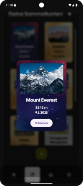
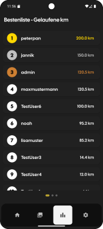
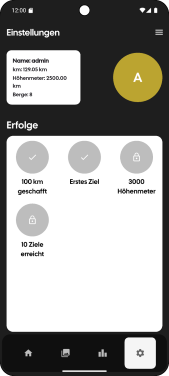
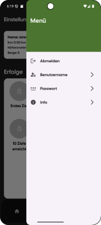

# Hermes
Hermes is a mobile app that allows you to track your hikes and collect mountains as cards. You can see your current location, start tracking, and view your collection of mountains. The app also features a leaderboard to compare your achievements with others. 

## Login/Register

Here you can easily login or register.

## Home

This is the homepage of Hermes. Here you see your current location and if you click on the button in the center of the screen you start the tracking.

After you start the tracking the button will turn red and on the top of the screen a little bar appears whichs shows you the current distance and time of your tracking.

If you click the button again the tracking will be paused and it will turn grey again.
Now you have two options:
- Save the tracking
- Continue the tracking

## Collection

Here you can see all your collection cards / mountains you have collected. You can also click on the cards to see a detailed view of the mountain. If you click on the button on the top right corner you can sort your cards by rarity, hight or date.

This is the detailed view of a mountain.

## Leaderboard

This is the leaderboard... You can switch between three different categories:
- km
- altitude meter
- mountains
Your own position is highlighted green.

## Settings

This is the settings page. Here you can see your stats like the total distance, altitude and mountains you have collected. You also see achievements you have unlocked and those you can still unlock. If you click on the button on the top right corner you can logout.

