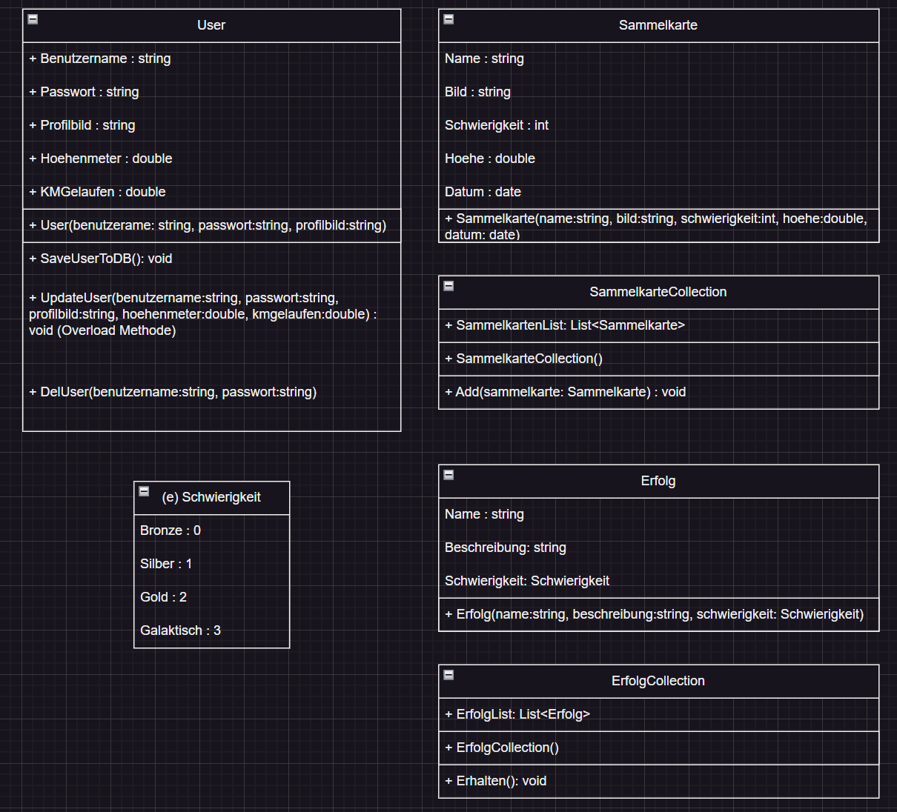
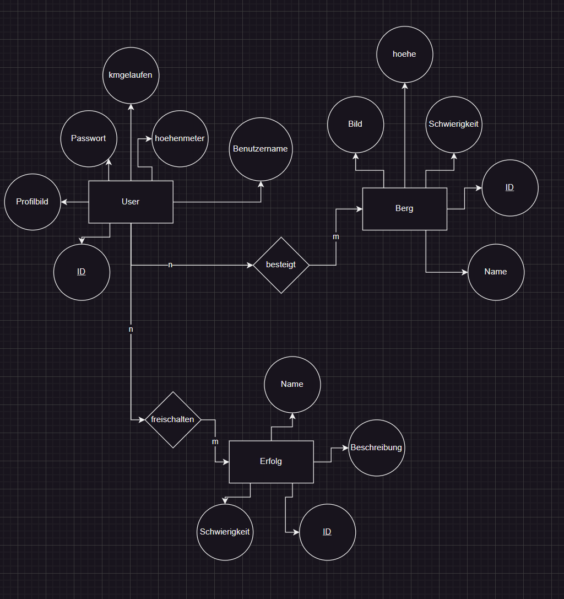
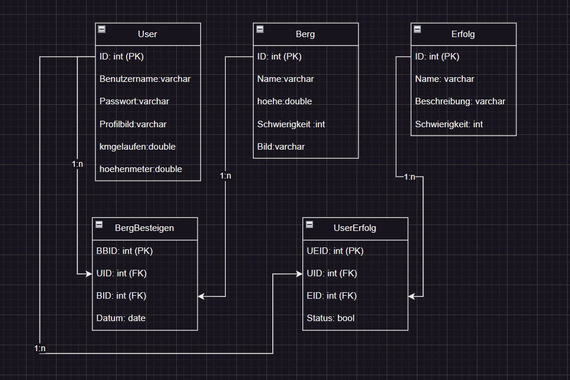
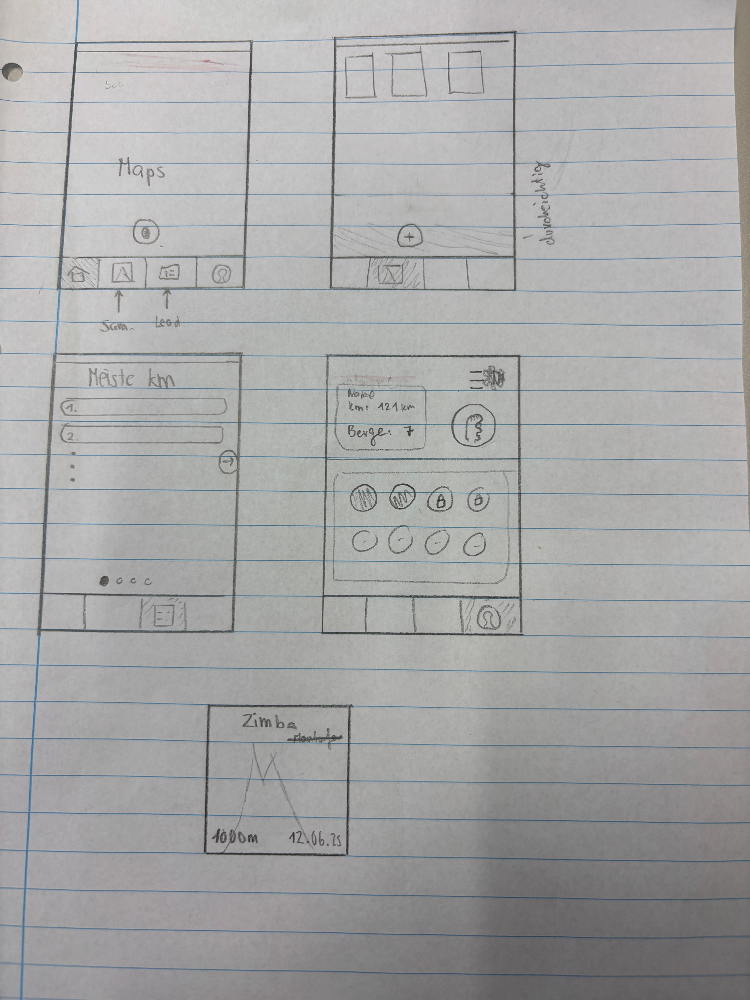
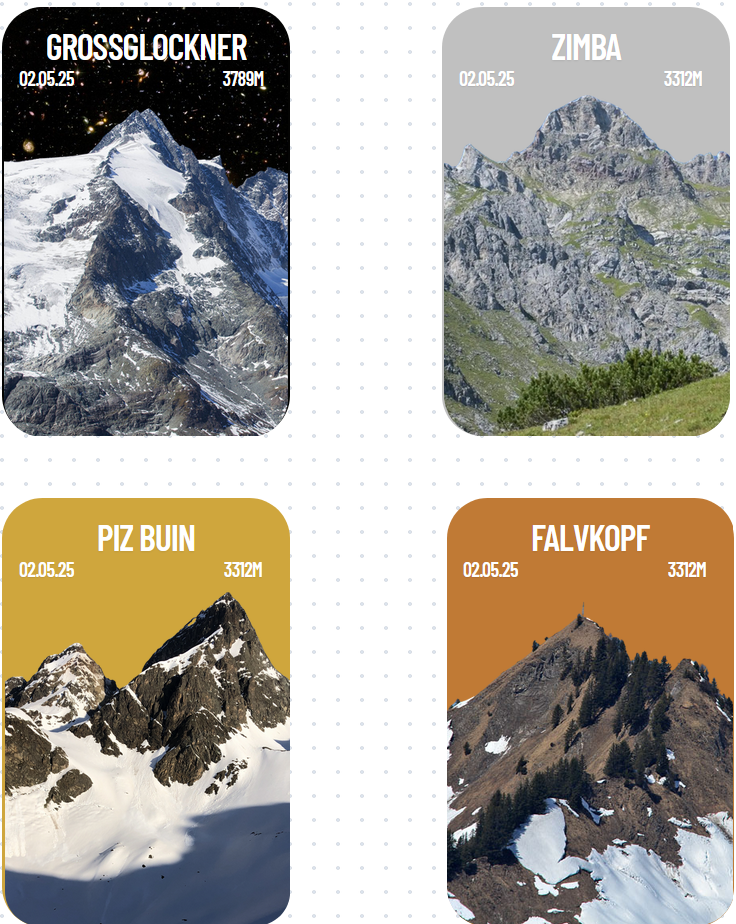

# Projektvorschlag und Grobkonzept

## Projekttitel
Hermes

## Kurzbeschreibung
Eine dezente Applikation, ein Sammelspiel, das seinesgleichen sucht. Hermes soll den Weg zu einer naturbewussteren Lebensweise ebnen. Der Jugend soll es eine Möglichkeit sein, die Wanderlust zu entdecken. Und den Erwachsenen soll es eine Möglichkeit sein, zu ebendieser zurückzufinden. 
Das Festhalten von Daten in Form von Bestenlisten und Erfolgen kombiniert mit einer sammelspielartigen Kartenjagd - die perfekte App für dich und für dein Wanderherz.

## Github Link
https://github.com/BlJanosch/Hermes

## Arbeitsaufteilung
|Aufgabe|Zuständigkeit|
|-|-|
Startseite | J |
Sammlung | N |
Leaderboard | N |
User | J |
Planung REST-API | J & N |
DB mit Maria DB | J & N |

## Softwarekonzept
- Programmiersprache
  - Flutter
- geplante Techniken
  - NFC-Chips
  - GPS via Google Maps

### Klassendiagramm

### ERM 

### RM

### UI-Design

### Kartendesign

